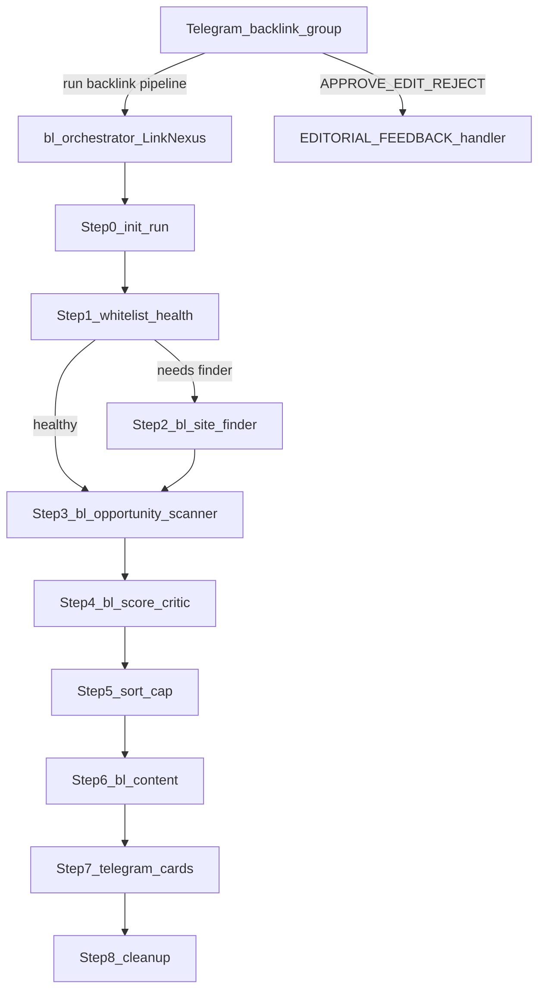

# Agent Pipeline Registry — Backlink OpenClaw

**Last updated:** 2026-07-03 (Per-project Telegram group isolation)  
**Purpose:** Canonical living reference for the backlink whitelist pipeline — all agents, prompts, tools, skills, pipeline steps, and scripts.  

> **ARCHITECTURE (current): Dual-loop "Farmer".** Backlinking now runs as two
> independent loops sharing one SQLite DB:
> - **Harvest Loop** — `nexus_daemon.py`, a 24/7 pure-Python service that scans
>   one due site per tick, scores leads deterministically, runs a cheap-LLM
>   quality gate on the top-N, and on demand invokes Ink (`bl-content`) + sends
>   cards. No LLM orchestration cost.
> - **Management Loop** — `bl-orchestrator` (LinkNexus), an interactive Telegram
>   manager that only runs when messaged. Adds/edits/pauses projects, inspects
>   status/sources, triggers scans, finds sites — all via the deterministic
>   `manage_projects.py` tool.
>
> The legacy batch pipeline (Steps 0–8, "run backlink pipeline") is retained
> below for reference but is no longer the primary path; harvesting is continuous.
**Config source of truth:** [`openclaw.json`](openclaw.json)  
**Instance:** Separate OpenClaw profile — always use `openclaw --profile backlink` (state dir `~/.openclaw-backlink`, gateway port **19789**). Not the news app at `~/.openclaw`.

> **Secrets policy:** This file documents *where* credentials live (`openclaw.json`, `config/telegram_card_config.json`, `TOOLS.md`) but never copies tokens, passwords, or API keys.

---

## Maintenance triggers

Update this registry in the **same change** whenever you edit any of:

| Category | Paths |
|----------|-------|
| Config | `openclaw.json`, `exec-approvals.json` |
| Prompts | `workspace-bl-*/SOUL.md`, `workspace-bl-*/AGENTS.md`, `workspace-bl-*/IDENTITY.md`, `workspace-bl-*/TOOLS.md` |
| Skills | `workspace-bl-orchestrator/skills/**`, `workspace-bl-content/skills/**` |
| Pipeline scripts | `workspace-bl-orchestrator/skills/pipeline/**` |
| Editorial | `workspace-bl-orchestrator/EDITORIAL_FEEDBACK.md`, `config/telegram_card_config.json` |

On each update: bump **Last updated**, edit only affected sections, append one line to **Change log**.

---

## Architecture



**Delegation:** `sessions_spawn` + `sessions_yield` only. Do **not** use `openclaw agent ... --deliver` in bash.

**Spawn contract:** Every `sessions_spawn` MUST include `agentId` set to one of the four worker IDs. Omitting `agentId` spawns a copy of LinkNexus and corrupts the run.

**Handoffs:** File-first. Workers write to `/tmp/backlink-run-<RUN_ID>/`. Chat returns `SUCCESS` or `FAILURE`. LinkNexus validates disk artifacts with Python/bash scripts before proceeding.

**Entry point:** Telegram bound to `bl-orchestrator` (`openclaw.json` → `bindings`, account `backlink`). Legacy default group `-5291081154`; each project may have its own supergroup (see **Per-project Telegram isolation** below).

**Editorial feedback:** Card APPROVE/EDIT/REJECT is **not** a pipeline step — see `workspace-bl-orchestrator/EDITORIAL_FEEDBACK.md`.

---

## Global configuration

| Setting | Value |
|---------|-------|
| Profile / state dir | `backlink` → `~/.openclaw-backlink/` |
| Default model | `local-bifrost/vertex/gemini-3.1-flash-lite` |
| Default workspace | `/home/bhard/.openclaw-backlink/workspace-bl-orchestrator` |
| LLM backend | Bifrost Vertex Gemini via `local-bifrost` (`openclaw.json`); Pro models in catalog only, never assigned |
| Tools profile | `coding` |
| Exec security | `full`, `ask: off` (`exec-approvals.json`) |
| Context injection | `always` |
| Web search | SearXNG plugin (`paulgo.io`) + orchestrator `skills/search/search.py` (DDG/SearXNG tiered) |
| Browser | Headless Chromium at `bin/chromium` |
| Hooks | `session-memory`, `boot-md` |
| Gateway | Local port **19789**, token auth, loopback |
| Telegram | Account `backlink` only (no news bot) |
| SQLite DB | `~/.openclaw-backlink/data/backlink.db` |

---

## Agent registry matrix

| Agent ID | Persona | Workspace | Model | Role |
|----------|---------|-----------|-------|------|
| `bl-orchestrator` | LinkNexus | `workspace-bl-orchestrator/` | gemini-3.1-flash-lite | Interactive manager (projects/sources/status); on-demand only |
| `bl-content` | Ink | `workspace-bl-content/` | gemini-2.5-flash (thinking=medium) | Write submission-ready posts; invoked by daemon and `send-cards` |
| `bl-gate` | Sentinel | `workspace-bl-gate/` | gemini-3.1-flash-lite (+ 2.5-flash fallback) | Quality gate: score top-N leads 0–10 via JSON file contract |
| `bl-site-finder` | Prospector | `workspace-bl-site-finder/` | gemini-3.1-flash-lite | Optional deeper domain qualification (deterministic `find-sites` is default) |
| `bl-opportunity-scanner` | Forager | `workspace-bl-opportunity-scanner/` | — | **RETIRED** — replaced by deterministic `scan_tool.py` in the daemon |
| `bl-score-critic` | Arbiter | `workspace-bl-score-critic/` | — | **RETIRED** — replaced by `score_opportunities.py` + `quality_gate.py` + `bl-gate` |

**Orchestrator subagent allowlist:** `bl-site-finder`, `bl-content`

**Harvest engine (NOT an agent):** `nexus_daemon.py` runs the scan→score→gate→draft
loop as a pure-Python service. Gate primary path: `bl-gate` agent (Nova Lite).
Fallback: direct Bifrost API (Nova Lite → MiniMax). Ink invoked via
`openclaw --profile backlink agent --agent bl-content` for drafting.
On-demand cards: `manage_projects.py send-cards`.
Resend unacted pending: `manage_projects.py resend-pending` (DB source of truth; UPDATE same row).

---

## Prompt assembly

OpenClaw injects workspace markdown at session start:

| File | Role |
|------|------|
| `SOUL.md` | Primary behavioral contract (the real prompt) |
| `AGENTS.md` | Universal safety / worker rules |
| `IDENTITY.md` | Name, role, persona |
| `TOOLS.md` | Environment notes (no secrets in registry) |
| `EDITORIAL_FEEDBACK.md` | Card feedback handler (orchestrator only) |

Plus runtime base text and skill catalog from `SKILL.md` files.

**Cross-instance context:** Read this file (`~/.openclaw-backlink/AGENT_PIPELINE_REGISTRY.md`) for full pipeline state when resuming work on the backlink app.

---

## Per-agent profiles

### Orchestrator — LinkNexus (`bl-orchestrator`)

| Field | Value |
|-------|-------|
| Workspace | `workspace-bl-orchestrator/` |
| SOUL | `workspace-bl-orchestrator/SOUL.md` |
| Role | Sequence workers, validate every step, send Telegram cards, never write backlink content |
| Model | gemini-3.1-flash-lite (+ 2.5-flash fallback) |

**Tools (config extras):** `agents_list`, `nodes`, `message`, `gateway`, `browser`, `canvas`, `tts`, `sessions_spawn`, `sessions_yield`, `subagents`

**Pipeline steps:**

| Step | Action |
|------|--------|
| 0 | `init_run.sh` → run bundle `/tmp/backlink-run-<RUN_ID>/`, env `/tmp/backlink-run-env.sh` |
| 1 | `check_whitelist_health.py` — may seed + skip or spawn finder |
| 2 | Spawn Prospector (conditional) → `merge_new_sites.py` |
| 3 | Spawn Forager → `dedupe_opportunities.py` → `validate_scan.py` |
| 4 | Spawn Arbiter → `validate_score.py` → `evict_underperformers.py` |
| 5 | `sort_opportunities.py` → `content_queue.json` (top 30) |
| 6 | Spawn Ink → `validate_content.py` |
| 7 | `build_and_send_card.py --ordered` |
| 8 | `cleanup_run_artifacts.sh` |

**Retry policy:** Max 2 retries per step (3 total attempts), then fatal stop. Step 2 skip when `WHITELIST_HEALTHY:`.

**Spawn schema (mandatory keys):**

```json
{
  "agentId": "<bl-site-finder | bl-opportunity-scanner | bl-score-critic | bl-content>",
  "mode": "run",
  "runtime": "subagent",
  "context": "isolated",
  "task": "<multi-line task from SOUL step>"
}
```

---

### Site Finder — Prospector (`bl-site-finder`)

| Field | Value |
|-------|-------|
| Workspace | `workspace-bl-site-finder/` |
| SOUL | `workspace-bl-site-finder/SOUL.md` |
| Role | Discover **domain-level** candidates for whitelist (max 5), never individual post URLs |
| Model | gemini-3.1-flash-lite (+ 2.5-flash fallback) |

**Tools:** `coding` profile + `browser`, `web_search`, `web_fetch`

**Discovery path:** `workspace-bl-orchestrator/skills/search/search.py` only (not raw `web_search` for queries).

**Output:** `$RUN_DIR/finder/new_sites.json` — `{ status, niche, project_url, sites: [{ domain, credibility_notes, source_evidence_url }] }`

**Fail-loud:** Zero candidates → error JSON + yield FAILURE.

---

### Opportunity Scanner — Forager (`bl-opportunity-scanner`)

| Field | Value |
|-------|-------|
| Workspace | `workspace-bl-opportunity-scanner/` |
| SOUL | `workspace-bl-opportunity-scanner/SOUL.md` |
| Role | Find actionable URLs **inside whitelist only** via `site:<domain>` queries |
| Model | gemini-3.1-flash-lite (+ 2.5-flash fallback) |

**Tools:** `coding` profile + `browser`, `web_fetch` (no `web_search` in config)

**Output:** `$RUN_DIR/scan/opportunities.json` — up to 5 opportunities per domain, max ~30 total.

**Required fields per opportunity:** `url`, `domain`, `type`, `target_title`, `target_excerpt`, `opportunity_context`, `posting_action`, etc.

---

### Score Critic — Arbiter (`bl-score-critic`)

| Field | Value |
|-------|-------|
| Workspace | `workspace-bl-score-critic/` |
| SOUL | `workspace-bl-score-critic/SOUL.md` |
| Role | Execute `score_opportunities.py`, write narration to `evictions.json`, yield SUCCESS |
| Model | gemini-3.1-flash-lite (+ 2.5-flash fallback) |

**Tools:** `coding` profile only (no web tools)

**Does NOT:** Recalculate scores, browse web, or modify opportunity list.

---

### Gate — Sentinel (`bl-gate`)

| Field | Value |
|-------|-------|
| Workspace | `workspace-bl-gate/` |
| SOUL | `workspace-bl-gate/SOUL.md` |
| Role | Score top-N harvest leads 0–10 for backlink-reply fit; write `gate_result.json` |
| Model | gemini-3.1-flash-lite (+ 2.5-flash fallback; thinking=off) |

**Tools:** `coding` profile; `exec`, `web_search`, `web_fetch`, `browser`, `image_generate` **denied**.

**Input:** `$RUN_DIR/gate_batch.json` (written by `quality_gate.py`).

**Output:** `$RUN_DIR/gate_result.json` — `{ status, scores: [{ i, score, reason }] }`.

**Invocation:** `quality_gate.py` → `openclaw agent bl-gate`; direct API fallback on failure.

---

### Content — Ink (`bl-content`)

| Field | Value |
|-------|-------|
| Workspace | `workspace-bl-content/` |
| SOUL | `workspace-bl-content/SOUL.md` |
| Role | Write submission-ready posts with embedded backlinks; optional images via `generate.sh` |
| Model | gemini-2.5-flash (+ 3.1-flash-lite fallback; thinking=medium) |

**Tools:** `coding` profile; `image_generate` **denied** — use bash skill only.

**Input (canonical):** `$RUN_DIR/content_queue.json` (from Step 5 sort).

**Output:** `$RUN_DIR/content/posts.json` (+ symlink `/tmp/backlink-content-posts.json`).

**Image skill:** `workspace-bl-content/skills/generate-image/generate.sh` (also allowlisted in `exec-approvals.json`).

---

## Pipeline scripts inventory

All under `workspace-bl-orchestrator/skills/pipeline/` unless noted.

| Script | Step | Purpose | Success tokens |
|--------|------|---------|----------------|
| `init_run.sh` | 0 | Create run bundle, manifest, env file | `[INIT] Backlink run bundle ready` |
| `check_whitelist_health.py` | 1 | Whitelist count / topup cadence | `WHITELIST_HEALTHY:`, `WHITELIST_NEEDS_FINDER:`, `WHITELIST_EMPTY:` |
| `seed_whitelist.py` | 1 | Seed tiers 1–2 platforms when empty | (used when `WHITELIST_EMPTY`) |
| `merge_new_sites.py` | 2 | Merge finder output into DB | `MERGE_SITES_OK:`, `MERGE_SITES_EMPTY:` |
| `dedupe_opportunities.py` | 3 | Dedup vs `seen_opportunities` | `DEDUPE_OK:`, `DEDUPE_ALL_SEEN:` |
| `validate_scan.py` | 3 | Validate scan JSON | `SCAN_VALID:`, `SCAN_EMPTY:`, `SCAN_INVALID:` |
| `score_opportunities.py` | 4 | Deterministic 0–100 scoring | `SCORE_OK:` |
| `validate_score.py` | 4 | Validate scored JSON | `SCORE_VALID:`, `SCORE_EMPTY:`, `SCORE_INVALID:` |
| `evict_underperformers.py` | 4 | Bench low-usability sites (floor min 5) | `EVICT_OK:`, `EVICT_FLOOR_HIT:` |
| `sort_opportunities.py` | 5 | Rank and cap queue (default top 30) | `SORT_OK:`, `SORT_EMPTY:` |
| `validate_content.py` | 6 | Validate posts.json | `CONTENT_VALID:`, `CONTENT_INVALID:` |
| `build_and_send_card.py` | 7 | Telegram cards (fail-open) | `CARD_SENT:`, `CARDS_SUMMARY:` |
| `handle_card_feedback.py` | editorial | APPROVE/EDIT/REJECT callbacks | (handler stdout) |
| `update_manifest_step.sh` | all | Update manifest step status | `[MANIFEST] step=...` |
| `cleanup_run_artifacts.sh` | 8 | Terminal cleanup (preserves RUN_DIR) | `[cleanup] Done` |
| `whitelist_db.py` | — | SQLite schema + helpers | — |
| `backlink_db.py` | — | Opportunities + feedback events | — |
| `manifest_paths.py` | — | Manifest path helpers | — |

### Farmer (dual-loop) scripts

| Script | Loop | Purpose | Output token |
|--------|------|---------|--------------|
| `nexus_daemon.py` | Harvest | 24/7 loop: scan→score→gate→draft+send. `--once` / `--max-ticks` for testing | `[nexus ...]` logs |
| `run_daemon.sh` | Harvest | Supervised launcher (auto-restart + logs); `--install-help` prints systemd unit | — |
| `scan_tool.py` | Harvest | Atomic `scan_single_url(domain,niche)` (deterministic Forager) | `SCAN_ONE: status=...` |
| `quality_gate.py` | Harvest | `bl-gate` agent + direct API fallback (Nova Lite → MiniMax); fail-open | `GATE_OK: ...` |
| `harvest_draft.py` | Harvest | Shared Ink draft + Telegram send (daemon + `send-cards`) | — |
| `resend_pending.py` | Harvest | DB-first repost of pending editorial cards (`resend-pending`, daemon resurface) | — |
| `manage_projects.py` | Management | Project/source CRUD, scan-now, scan-domain, set-priority, find-sites, send-cards, resend-pending, `--group-id`/`--bind` | `OK:` / `ERROR:` |
| `onboard_backlink.py` | Onboarding | Deterministic Telegram `/onboard` wizard engine (no LLM); terminal `wizard` subcommand | `OK:` / `ERROR:` |
| `bind_telegram_group.py` | Onboarding | Idempotent patch of `openclaw.json` group ACL + `PROJECT_URL` systemPrompt + bl-orchestrator binding; syncs DB | `BIND_OK:` / `BIND_DRY_RUN:` |
| `opportunity_hunter.py` | Harvest | Cheap-LLM query planner (cached 24h, low-yield only) | (library) |

**Discovery modules (search/):** `query_expander.py`, `x_filter.py`, `openweb_hunt.py`, `competitor_hunt.py`, `opportunity_hunter.py` — wired into `nexus_daemon.py` and `scan_tool.py`.

**Daemon config (env):** `BL_AIR_GAP_SECONDS` (30), `BL_SITES_PER_TICK` (3),
`BL_GATE_TOP_N` (20), `BL_GATE_THRESHOLD` (6.0), `BL_DRAFT_BATCH_MIN/MAX` (1/5),
`BL_DELIVERY_INTERVAL_MIN` (60), `BL_OPENWEB_EVERY_TICKS` (4),
`BL_COMPETITOR_EVERY_TICKS` (8), `BL_LOW_YIELD_THRESHOLD` (3),
`BL_BLOCK_BACKOFF_HOURS` (0.25), `BL_MAX_AGE_DAYS` (7),
`BL_GATE_USE_AGENT` (true), `BL_GATE_AGENT` (`bl-gate`),
`BL_GATE_MODEL` (`vertex/gemini-3.1-flash-lite`), `BL_GATE_MODEL_FALLBACK` (`vertex/gemini-2.5-flash`), `BL_HUNTER_MODEL` (`vertex/gemini-3.1-flash-lite`), `IMAGE_MODEL` (`vertex/gemini-3.1-flash-lite-image`), `IMAGE_MODEL_FALLBACK` (HF FLUX),
`BL_DB_PATH`.

**Lead lifecycle (`harvest_leads`):** `NEW → SCORED → GATED → DRAFTED → SENT`
(or `REJECTED` by the gate, `FAILED` on draft/send error). The existing
`opportunities` row is still created at card-send time, so the editorial
APPROVE/EDIT/REJECT loop is unchanged.

**Management skill:** `workspace-bl-orchestrator/skills/manage/SKILL.md` (read on
demand by LinkNexus) — command reference for `manage_projects.py`.

**Search (shared):** `workspace-bl-orchestrator/skills/search/search.py` — DDG → SearXNG tiered search; used by `scan_tool.py`, `discover.py`, and `manage_projects.py find-sites`.

**Platforms seed data:** `workspace-bl-orchestrator/skills/platforms/platforms.json`

---

## Run-bundle layout

Each run creates `/tmp/backlink-run-<RUN_ID>/`:

```
backlink-run-<RUN_ID>/
├── manifest.json
├── content_queue.json          # Step 5 output → Step 6 input
├── finder/new_sites.json
├── scan/opportunities.json
├── scan/deduped.json
├── score/scored.json
├── score/evictions.json
├── content/posts.json
├── content/images/
└── delivery/card.json
```

**Env file:** `source /tmp/backlink-run-env.sh` sets `RUN_ID`, `RUN_DIR`, `PIPELINE_MANIFEST`, `BL_NICHE`, `BL_PROJECT_URL`, `BL_PROJECT_NAME`, `BL_PROJECT_DESCRIPTION`, `BL_PROJECT_ID`.

**Legacy symlinks:** `/tmp/backlink-pipeline-manifest.json`, `/tmp/backlink-content-posts.json`, `/tmp/backlink-active-run`.

**Retention:** Run dirs older than 7 days pruned on next `init_run.sh`.

---

## Data layer (`data/backlink.db`)

| Module | Tables / role |
|--------|----------------|
| `whitelist_db.py` | `projects` (+`status`,`config_json`,`scan_interval_minutes`), `whitelist_sites` (+`next_scan_due`,`failure_count`,`cooldown_until`), `harvest_leads` (Farmer lead lifecycle), `site_score_history`, `seen_opportunities`, `pipeline_runs` |
| `backlink_db.py` | `opportunities`, `feedback_events`, `content_versions`, `edit_sessions` |

**Min whitelist floor:** 5 active sites per project (`MIN_WHITELIST` in `whitelist_db.py`).

**Schema migrations:** additive only. `whitelist_db.init_whitelist_db()` runs
`ALTER TABLE ... ADD COLUMN` for the new `projects`/`whitelist_sites` columns when
missing, so existing databases upgrade in place without data loss.

**Project personalization:** the `projects.config_json` blob is the single source
of truth (description, tone, target_keywords, anchor_text, subreddits, competitors).
Both the daemon (Ink prompts, gate context, query expansion) and the manager read it.

**Whitelist policy:** domains are never auto-evicted. `scan_priority` (0-100) orders
which sites scan first; manual pin via `manage_projects.py set-priority`.

### Per-project Telegram isolation

Each backlink project may route cards and management traffic to its own Telegram
supergroup (mirrors the News Agent pattern):

| Layer | Mechanism |
|-------|-----------|
| **DB (single source of truth)** | `projects.telegram_group_id`, `telegram_group_name`, optional `card_prefix` |
| **Card routing (egress)** | `build_and_send_card.py` → `resolve_chat_id(project_url)`; falls back to global `config/telegram_card_config.json` when unset |
| **Chat scoping (ingress)** | `backlink-onboarder` plugin → `before_prompt_build` / `before_agent_start` reads DB via `resolve_project_for_group(chatId)` parsed from `sessionKey`; injects `PROJECT_URL` dynamically |
| **openclaw.json** | Generic catch-all only (`groups["*"]`, one bl-orchestrator binding) — **no per-project entries** |
| **Onboarding** | Telegram `/onboard` → `manage_projects.py add` (DB + whitelist) + DB scope verify; **no openclaw.json edit** |
| **Legacy bind CLI** | `bind_telegram_group.py --apply --skip-openclaw` (DB only) or full patch if needed |
| **Verify** | `project_telegram_scope.py verify-all` |
| **Delivery throttle** | Per-project in `nexus_daemon.py` (`_last_delivery_ts` keyed by `project_id`) |

Per-project groups are stored only in `projects.telegram_group_id`. The plugin scopes
LinkNexus at runtime; config file drift cannot drop project bindings.

---

## Entry commands

| User says | Route |
|-----------|-------|
| `run backlink pipeline` + **niche** + **project_url** (+ optional name/description) | `bl-orchestrator` SOUL Steps 0–8 |
| APPROVE, EDIT, REJECT, `bl_*` callback taps, edit `.md` upload | `EDITORIAL_FEEDBACK.md` |

Telegram groups: legacy default **backlink-agent** (`config/telegram_card_config.json` → `-5291081154`); per-project groups stored in `projects.telegram_group_id`.

---

## Exec approvals

Pre-allowlisted scripts for `bl-orchestrator` and `bl-content` in `exec-approvals.json` (pipeline scripts + image generate). See file for full allowlist patterns.

---

## Ops notes

| Task | Command |
|------|---------|
| CLI (always) | `openclaw --profile backlink ...` |
| Dashboard | http://127.0.0.1:19789/ |
| Device scope upgrade | `openclaw --profile backlink devices approve <requestId>` — **not** Telegram `/approve` |
| List devices | `openclaw --profile backlink devices list --json` |

This backlink app is **fully separate** from the news pipeline at `~/.openclaw` (port 18789). Do not mix profiles, workspaces, or Telegram bots.

---

## Related docs

| File | Purpose |
|------|---------|
| **`AGENT_PIPELINE_REGISTRY.md`** | This file — canonical living reference |
| `PIPELINE_ARCHITECTURE.md` | High-level architecture overview |
| `workspace-bl-orchestrator/SOUL.md` | Step-by-step orchestrator procedure |
| `workspace-bl-orchestrator/EDITORIAL_FEEDBACK.md` | Post-pipeline card feedback |

---

## Change log

| Date | Change |
|------|--------|
| 2026-07-03 | **Offline `/onboard` for new projects.** Added `backlink-onboarder` plugin + `onboard_backlink.py` (Telegram wizard, no LLM): group id → URL → niche → name → description → confirm; finalizes via `manage_projects.py add` + `bind_telegram_group.py --apply`. Session state in `onboard_sessions` table. Terminal fallback: `onboard_backlink.py wizard`. |
| 2026-07-03 | **Per-project Telegram isolation.** Added `projects.telegram_group_id`/`telegram_group_name`/`card_prefix` (additive migrations). `build_and_send_card.py` routes cards per project with global fallback. `nexus_daemon.py` per-project delivery throttle. New `bind_telegram_group.py` (idempotent `openclaw.json` patch + DB sync). `manage_projects.py`: `--group-id`, `--group-name`, `--bind`, `--apply`. LinkNexus SOUL: bound-group `PROJECT_URL` is authoritative. |
| 2026-06-26 | **Search reliability + English filter + approve feedback.** Fixed `search.py` ddgs tier `_merge` bug (single-result list wrap) that dropped all ddgs hits. Raised `BL_DDG_TIMEOUT=20`, `BL_DDG_RETRIES=3`, default `BL_DDG_BACKENDS=auto`; disabled dead html/lite scrape tiers (`BL_ENABLE_DDG_HTML=0`). Added `lang_filter.py` + English-only enforcement in `make_lead` (all harvesters). `vocab_miner` now mines approved opportunity title/excerpt (+5 weight); `handle_card_feedback.py` triggers mining on APPROVE. Gate prompt rejects non-English. `run_daemon.sh` exports search env defaults. |
| 2026-06-26 | **Opportunity Flywheel.** Per-site `harvest_cursors` + combinatorial `query_planner` (keyword×modifier rotation, epsilon-greedy bandit via `query_stats`). `harvester_registry.py` routes domains: `reddit_api`, `hn_algolia`, `rss_sitemap`, `generic_search` fallback. Controlled re-arm (`BL_REARM_TTL_DAYS`) revives stale leads; editorial approve/reject sets `editorial_locked`. `vocab_miner` grows `vocab_terms`; graph-follow `domain_candidates` + periodic finder merge. Defaults: `BL_SITES_PER_TICK=5`, `BL_SCAN_MAX_PER_SITE=20`, `BL_SCAN_QUERY_LIMIT=8`, `BL_SEARCH_QUERY_DELAY=4`. |
| 2026-06-25 | **Pipeline verbose logging.** New `pipeline_log.py` with `BL_LOG_LEVEL=info|verbose|trace`. At `verbose`, one `tail -f nexus_daemon.log` shows due sites, search queries/hits, scores, gate reasons, draft/send, and per-tick funnel counts. Opt-in via `export BL_LOG_LEVEL=verbose` + daemon restart. |
| 2026-06-25 | **IST timezone everywhere.** New `pipeline_tz.py` (`BL_TIMEZONE=Asia/Kolkata` default): DB writes, daemon logs, run IDs, Telegram card footer, and `list-pending`/`sources` display use IST. Stale-pending cutoff uses Python IST (not SQLite UTC). Internal whitelist scheduling still uses SQLite UTC; shown as IST via `format_utc_sqlite_display`. `run_daemon.sh` exports `TZ`. |
| 2026-06-25 | **resend-pending + draft dedup.** `resend_pending.py` + `manage_projects.py resend-pending`/`list-pending` repost pending cards from DB (UPDATE same row). Stopped `published_snapshot` on first send; `content_md` is canonical. Fixed `phase_resurface` (per-opportunity DB resend; removed manifest batch + SENT→GATED). Fixed `card_sent_at` SQLite datetime format for 24h stale query. Persist `score_100`/`rank` on opportunities. |
| 2026-06-25 | **bl-gate agent + on-demand cards.** Added `bl-gate` (Sentinel, Nova Lite) for quality gate via `gate_batch.json`/`gate_result.json`; `quality_gate.py` agent path + API fallback. New `harvest_draft.py` shared by daemon and `manage_projects.py send-cards`. Delivery defaults: 5 cards / 30 min. Model catalog: `amazon.nova-lite-v1:0`. |
| 2026-06-25 | **Farmer v2 — hybrid high-yield discovery.** Added `query_expander.py`, `x_filter.py` (drop X profile pages, keep `/status/` threads), `openweb_hunt.py`, `competitor_hunt.py`, `opportunity_hunter.py` (cheap LLM query planner, 24h cache). `discover.py`: `clean_terms`, `niche_overlap_score`. `scan_tool`/`reddit_scan`: wider queries + relevance scoring. `nexus_daemon`: `phase_openweb`, `phase_competitor`, `phase_refresh_priorities`, hourly delivery batch (`BL_DELIVERY_INTERVAL_MIN`), bumped volume defaults. `whitelist_db`: `scan_priority` column + priority-ordered `get_due_sites`. `manage_projects`: `--competitors`, `scan-domain`, `set-priority`. Whitelist permanent (no auto-eviction). Tests: `test_farmer_v2.py`. |
| 2026-06-24 | **Discovery overhaul.** Inducted news Scout tools: `search_tool.py` (ddgs), `read_tool.py` (Jina), `resolve_url.py`, `lead_enrich.py`, `reddit_scan.py`. `search.py` now ddgs-first. `scan_tool`/`discover` use snippet-trust + Jina (no curl-kill on Reddit). Daemon: faster defaults (`BL_AIR_GAP_SECONDS=30`, `BL_SITES_PER_TICK=2`, `BL_SCAN_MAX_PER_SITE=12`, `BL_DRAFT_BATCH_MIN=1`, short backoff). Editorial: seen URLs only on approve/reject; `phase_resurface` for stale pending cards. `manage_projects`: `reset-opportunities`, `reset-cooldowns`, `--subreddits`. `JINA_API_KEY` in openclaw.json. |
| 2026-06-23 | **LinkNexus Farmer Evolution.** Converted from manual batch pipeline to continuous dual-loop engine. Added `nexus_daemon.py` (24/7 harvest: scan→score→gate→draft+send), `run_daemon.sh`, `scan_tool.py` (atomic deterministic Forager), `quality_gate.py` (cheap `zai.glm-4.7-flash` relevance/spam gate, hybrid scoring), `manage_projects.py` + `skills/manage/SKILL.md` (deterministic project/source CRUD). Extended `whitelist_db.py`: project `status`/`config_json`/`scan_interval_minutes`, site `next_scan_due`/`failure_count`/`cooldown_until`, new `harvest_leads` lifecycle table, additive ALTER migrations. Rewrote `bl-orchestrator` SOUL/AGENTS from pipeline sequencer to interactive manager (thin agent + fat tools, lazy skill loading, ask-then-execute, hard guardrails, fail-loud). `openclaw.json`: bl-orchestrator → minimax-m2.5, subagent allowlist trimmed to `bl-site-finder`+`bl-content`; retired `bl-opportunity-scanner` and `bl-score-critic` from the hot path. exec-approvals: added new scripts. Editorial APPROVE/EDIT/REJECT loop unchanged. |
| 2026-06-22 | **Bedrock model migration.** Replaced Gemini Vertex catalog with 10 Bedrock open-weight models from news stack. Assignments: bl-orchestrator + bl-content → glm-5; bl-site-finder + bl-opportunity-scanner → minimax-m2.5; bl-score-critic → kimi-k2.5. Synced `agents/bl-*/agent/models.json`. Backup: `openclaw.json.pre-bedrock-models.bak`. |
| 2026-06-22 | Initial backlink registry created after split from main OpenClaw. Documents 5-agent whitelist pipeline, run-bundle model, scripts, and separate `--profile backlink` instance. |
